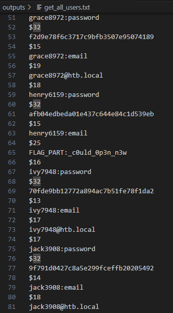

# RedTrails

## Description

During a recent red team engagement one of our servers got compromised. Upon completion the red team should have deleted any malicious artifact or persistence mechanism used throughout the project. However, our engineers have found numerous of them left behind. It is therefore believed that there are more such mechanisms still active. Can you spot any, by investigating this network capture?

## Analysis


### Part 1 - Redis Enumeration

The initial phase of the attack involved the compromise of a Redis database.

The attacker retrieved user credentials by executing an `HGETALL` command on the `users_table`. 


This provided a list of `user:password` pairs, showcasing a critical lapse in the security of the Redis implementation. The compromised credentials pose a severe threat to the confidentiality of user accounts.

> Check the output here: [users list](./outputs/get_all_users.txt)

<details>
<summary>Middle part of the Flag</summary>


 
```perl
_c0uld_0p3n_n3w
```
</details>

### Part 2 - Obfuscated Script

#### Overview

The attacker play with the environment from redis to edit the crontab.


Allowing the download of a file from a `http://files.pypi-install.com/packages/VgLy8V0Zxo` and executing it

#### Trigger

Within the network capture, an HTTP GET request was identified, containing an obfuscated Bash script.


> The content of this request show the content of the package [VgLy8V0Zxo](./outputs/VgLy8V0Zxo.txt)


Upon deobfuscation, the script revealed a series of actions, including string reversal and base64 decoding.

> We can make a bash script [safe_exec_VgLy8V0Zxo](./scripts/safe_exec_VgLy8V0Zxo.sh) to retrieve safely the content.


> The ouput of the picture is stored in [revert_base64_content](./outputs/revert_base64_content.txt)

Subsequently, a decoded Bash script emerged, responsible for updating the authorized_keys file with an SSHRSA key, providing the attacker with persistent access.

> We can make another bash script from the content to safely retrieve the result: [intrusion](./scripts/intrusion_from_VgLy8V0Zxo_content.sh)

<details>
<summary>Start of the Flag</summary>


 
```delphi
HTB{r3d15_1n574nc35
```
</details>

### Part 3 - Unkwown Redis Module

#### Overview

Further examination of the network traffic exposed the addition of a Redis module, expanding the attack surface and potentially facilitating advanced functionalities within the Redis environment. 
The nature and purpose of this module require additional investigation to comprehend its full impact on the compromised system.


#### Trigger

An ELF file, discovered within the response of a PSYNC request, revealed an additional layer of complexity in the attack.


Ghidra analysis exposed the implementation of AES encryption on subsequent requests.


Decryption using the key `h02B6aVgu09Kzu9QTvTOtgx9oER9WIoz` and the IV `YDP7ECjzuV7sagMN` unveiled the installation of an ethminer, indicating potential cryptocurrency mining operations.

<details>
<summary>End of the Flag</summary>


 
```delphi
_un3xp3c73d_7r41l5!}
```
</details>

<details>
<summary><h3>Complete Flag</h3></summary>

```delphi
HTB{r3d15_1n574nc35_c0uld_0p3n_n3w_un3xp3c73d_7r41l5!}
```
</details>