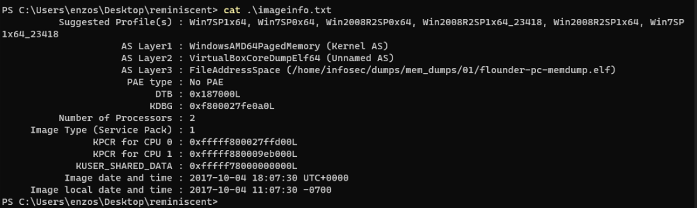
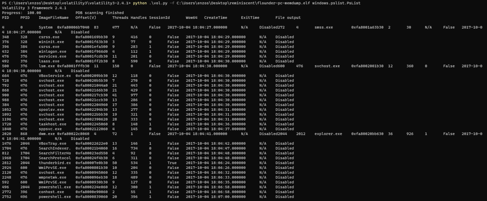
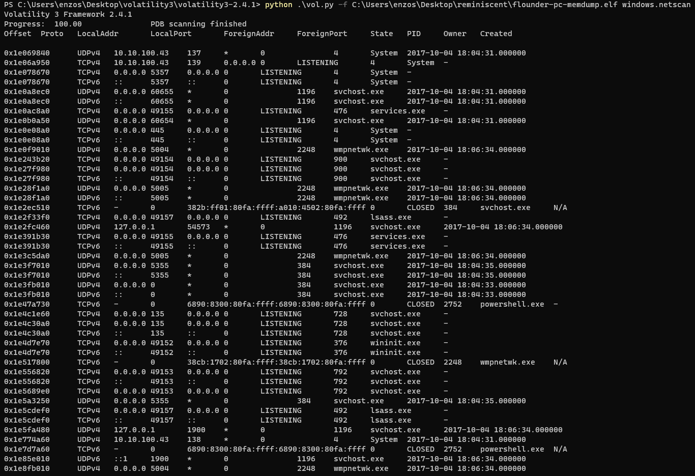
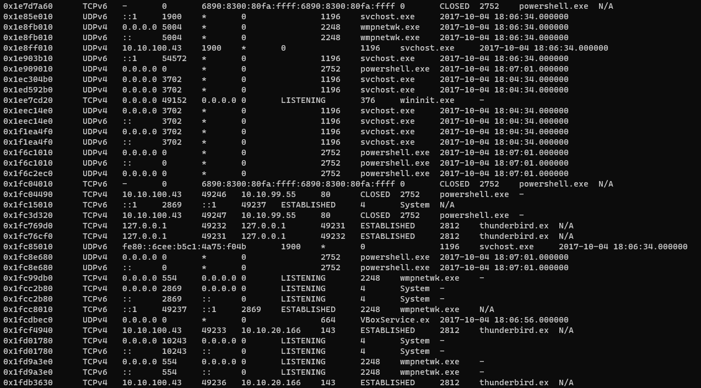
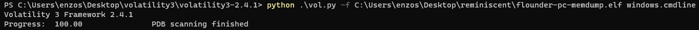
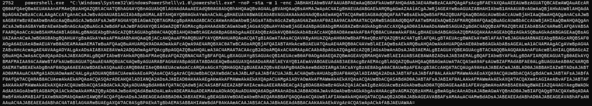
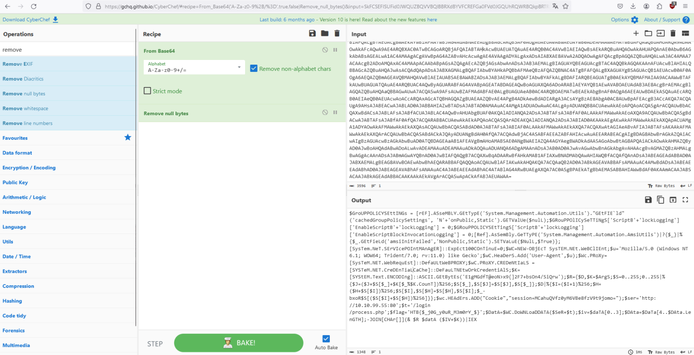
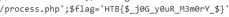

# Reminiscent - Write Up

## Description :

Suspicious traffic was detected from a recruiter&#039;s virtual PC. A memory dump of the offending VM was captured before it was removed from the network for imaging and analysis. Our recruiter mentioned he received an email from someone regarding their resume. A copy of the email was recovered and is provided for reference. Find and decode the source of the malware to find the flag.

## Setup :
First download the zip file and unzip the contents.

Download Volatility 3.0 on windows OS as we will use it throughout this
writeup, volatitlity allows us to read Memory dumps.

## Step 1 :
First lets get a look at imageinfo.txt using cat command.



## Step 2 :
We will then Use Volatility 3 to get information on the elf file :
"flounder-pc-memdump.elf" using windows.pslist.Pslist



We can remark that a Powershell.exe is running at some point in the
memory dump on PID 2752. This seems abnormal.

## Step 3 :

We will search more into it using windows.netscan command.





We can remark that Looking at PID 2752 that:
```
1.That there is powershell.exe, even though it might be benign, it is
possible that this might be used for setting up reverse shell.

2.That there is communication with port "80" using powershell.exe. This stoods out because a normal user (who is not that techsavvy) won't use "powershell.exe" to communicate with a website.
```
Let's dump out the command that would've been used to call
powershell.exe to investigate.

## Step 4 :

Lets now execute windows.cmdline in order to get the command related to
the powershell linked to pid 2752.





We can remark that the command ends with A= indicating hexadecimal
encoding, we will then decode it using CyberChef



This allow us to get the flag!


